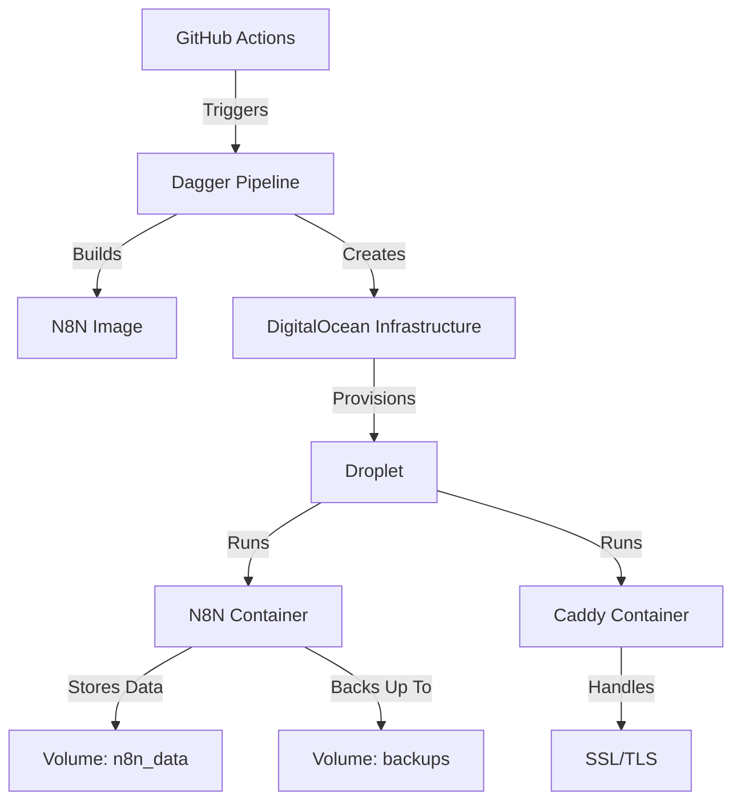

# N8N DigitalOcean CI/CD Automation

This repository contains an automated CI/CD pipeline for deploying N8N to DigitalOcean using GitHub Actions and Dagger. The setup includes automated droplet provisioning, security configurations, monitoring, and backup solutions.

## Features

- 🚀 **Automated Deployment**: One-command deployment of N8N to DigitalOcean
- 🔒 **Security First**: Built-in security features including SSL, firewalls, and fail2ban
- 📊 **Monitoring**: Integrated health checks and resource monitoring
- 💾 **Automated Backups**: Scheduled backups with retention policies
- 🔄 **Zero-Downtime Updates**: Smooth updates without service interruption
- 🛡️ **HTTPS Support**: Automatic SSL certificate management with Caddy
- 🎯 **Resource Management**: Configurable resource limits and scaling
- 📧 **Alerts**: Email and Slack notifications for important events

## Prerequisites

Before you begin, ensure you have:

1. **Accounts & Access**:
   - GitHub account
   - DigitalOcean account
   - Domain name pointed to DigitalOcean nameservers

2. **Local Tools**:
   - Go 1.19 or later
   - Docker and Docker Compose
   - `doctl` (DigitalOcean CLI)
   - Git

3. **API Access**:
   - DigitalOcean API token with write access
   - SSH key added to DigitalOcean

## Quick Start

1. **Clone the Repository**:
   ```bash
   git clone https://github.com/felipepimentel/n8n-digitalocean-cicd.git
   cd n8n-digitalocean-cicd
   ```

2. **Configure Environment**:
   ```bash
   cp .env.example .env
   # Edit .env with your values
   ```

3. **Generate Encryption Key**:
   ```bash
   openssl rand -hex 16
   # Add the output to N8N_ENCRYPTION_KEY in .env
   ```

4. **Run Setup Script**:
   ```bash
   ./scripts/init.sh
   ```

5. **Deploy N8N**:
   ```bash
   cd ci && go run main.go
   ```

## Configuration

### Required Environment Variables

| Variable | Description | Example |
|----------|-------------|---------|
| `DIGITALOCEAN_ACCESS_TOKEN` | DO API token | `dop_v1_...` |
| `DOCKER_REGISTRY` | DO container registry | `registry.digitalocean.com/n8n-registry` |
| `DO_SSH_KEY_ID` | SSH key fingerprint | `12:34:56:...` |
| `N8N_DOMAIN` | Your domain | `n8n.yourdomain.com` |
| `N8N_BASIC_AUTH_USER` | Admin username | `admin` (min 8 chars) |
| `N8N_BASIC_AUTH_PASSWORD` | Admin password | `your-secure-pass` (min 12 chars) |
| `N8N_ENCRYPTION_KEY` | 32-char key | Generate with `openssl` |

### Optional Environment Variables

| Variable | Description | Default |
|----------|-------------|---------|
| `N8N_VERSION` | N8N version | `latest` |
| `SLACK_WEBHOOK_URL` | Slack notifications | - |
| `ALERT_EMAIL` | Email notifications | - |
| `BACKUP_RETENTION_DAYS` | Backup retention | `7` |

## Architecture

The deployment consists of:



## Security Features

1. **Firewall (UFW)**:
   - Default deny incoming
   - Allow 22 (SSH), 80 (HTTP), 443 (HTTPS)
   - Rate limiting on SSH

2. **Fail2ban**:
   - Protection against brute force attacks
   - Auto-ban after 3 failed attempts
   - 1-hour ban duration

3. **Docker Security**:
   - Non-root user
   - Limited capabilities
   - Resource constraints
   - Read-only root filesystem

4. **SSL/TLS**:
   - Automatic certificate management
   - Modern cipher suites
   - HTTP/2 support
   - HSTS enabled

## Monitoring & Maintenance

### Health Checks

The system performs regular checks for:
- Container status
- Application health
- Resource usage (CPU, memory, disk)
- SSL certificate validity
- Backup status

### Alerts

Notifications are sent via:
1. Slack (if configured)
2. Email (if configured)

For events like:
- Service downtime
- High resource usage
- Failed backups
- Certificate renewal issues

### Backup System

Automated backups include:
1. N8N workflows
2. Credentials
3. Custom nodes
4. User data

Features:
- Daily backups
- Configurable retention
- Compression
- Integrity verification

## Updating N8N

To update N8N to a new version:

1. Update version in `.env`:
   ```bash
   N8N_VERSION=0.xxx.x
   ```

2. Redeploy:
   ```bash
   cd ci && go run main.go
   ```

The system will:
1. Build new image
2. Perform health check
3. Deploy with zero downtime
4. Verify deployment
5. Rollback on failure

## Troubleshooting

### Common Issues

1. **Deployment Fails**:
   ```bash
   # Check logs
   docker logs n8n-container
   # Check events
   doctl compute droplet-action list
   ```

2. **SSL Issues**:
   ```bash
   # Check Caddy logs
   docker logs caddy
   # Verify DNS
   dig your-domain.com
   ```

3. **Performance Issues**:
   ```bash
   # Check resource usage
   docker stats n8n-container
   # View logs
   tail -f /opt/n8n/logs/monitor.log
   ```

## Contributing

1. Fork the repository
2. Create your feature branch:
   ```bash
   git checkout -b feature/amazing-feature
   ```
3. Commit your changes:
   ```bash
   git commit -m 'Add amazing feature'
   ```
4. Push to the branch:
   ```bash
   git push origin feature/amazing-feature
   ```
5. Open a Pull Request

## License

This project is licensed under the MIT License - see the [LICENSE](LICENSE) file for details.

## Support

- GitHub Issues: For bug reports and feature requests
- Email: For security issues
- Documentation: For detailed setup and configuration

## Acknowledgments

- [N8N](https://n8n.io/) - The awesome workflow automation tool
- [DigitalOcean](https://www.digitalocean.com/) - For the amazing cloud infrastructure
- [Dagger](https://dagger.io/) - For the powerful CI/CD toolkit
- [Caddy](https://caddyserver.com/) - For the excellent web server
