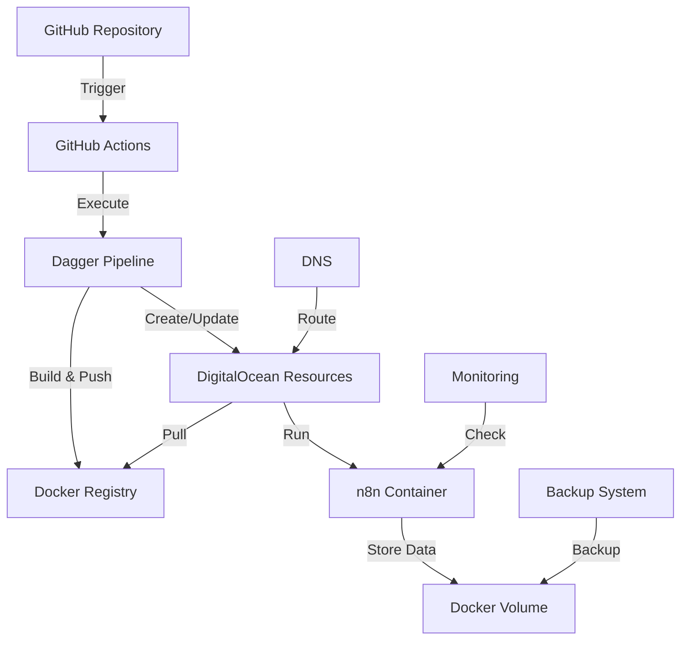

# Architecture Overview

This document provides a comprehensive overview of the architecture used in our n8n DigitalOcean deployment solution.

## Table of Contents

- [High-Level Architecture](#high-level-architecture)
- [Component Details](#component-details)
- [Security Architecture](#security-architecture)
- [Deployment Pipeline](#deployment-pipeline)
- [Monitoring & Backup Architecture](#monitoring--backup-architecture)

## High-Level Architecture



## Component Details

### 1. Infrastructure Components

#### DigitalOcean Resources
- **Droplet**
  - Size: s-2vcpu-2gb (2 vCPUs, 2GB RAM)
  - OS: Ubuntu 20.04 with Docker
  - Region: NYC1 (configurable)

- **VPC Network**
  - Private network for secure communication
  - CIDR: 10.10.10.0/24

- **Container Registry**
  - Stores n8n Docker images
  - Supports versioned deployments

- **Firewall**
  - Ports: 22 (SSH), 80 (HTTP), 443 (HTTPS)
  - Restricted access based on rules

### 2. Application Components

#### n8n Container
- Base Image: `n8nio/n8n`
- Custom Configuration:
  - Environment variables for security
  - Health checks
  - Resource limits
  - Persistent storage

#### Docker Configuration
```yaml
version: '3'
services:
  n8n:
    image: registry.digitalocean.com/n8n-app:latest
    restart: unless-stopped
    ports:
      - "80:5678"
      - "443:5678"
    environment:
      - NODE_ENV=production
      - N8N_PROTOCOL=https
      - N8N_PORT=5678
    volumes:
      - n8n_data:/home/node/.n8n
    healthcheck:
      test: ["CMD", "curl", "-f", "http://localhost:5678/healthz"]
      interval: 1m
      timeout: 10s
      retries: 3
```

## Security Architecture

### 1. Network Security

- **UFW (Uncomplicated Firewall)**
  - Default deny incoming
  - Allow ports 22, 80, 443
  - Rate limiting on SSH

- **fail2ban**
  - Protects against brute force attacks
  - Configurable ban times and thresholds

### 2. Application Security

- **Basic Authentication**
  - Required for all endpoints
  - Configurable username/password

- **Encryption**
  - Data at rest encryption
  - HTTPS for all traffic
  - Encryption key management

### 3. Infrastructure Security

- **SSH Security**
  - Key-based authentication only
  - Custom port option available
  - Regular key rotation recommended

- **Container Security**
  - No privileged containers
  - Resource limits enforced
  - Regular security updates

## Deployment Pipeline

### 1. GitHub Actions Workflow

```yaml
name: Deploy n8n
on:
  push:
    branches: [main]
  workflow_dispatch:

jobs:
  deploy:
    runs-on: ubuntu-latest
    steps:
      - Checkout code
      - Setup Go
      - Run Dagger pipeline
      - Deploy to DigitalOcean
```

### 2. Dagger Pipeline

The Dagger pipeline (`ci/main.go`) handles:

1. Infrastructure provisioning
2. Docker image building
3. Configuration management
4. Deployment orchestration

## Monitoring & Backup Architecture

### 1. Monitoring System

- **Health Checks**
  - HTTP endpoint monitoring
  - Resource usage tracking
  - Error rate monitoring

- **Alerting**
  - Slack notifications
  - Email alerts
  - Custom webhook support

### 2. Backup System

- **Automated Backups**
  - Daily snapshots
  - 7-day retention
  - Compressed storage

- **Backup Storage**
  - Local volume backups
  - Optional remote storage
  - Encryption at rest

## Performance Considerations

### 1. Resource Allocation

- **CPU**: 2 vCPUs recommended
- **Memory**: 2GB RAM minimum
- **Storage**: 50GB SSD recommended

### 2. Scaling Considerations

- Vertical scaling via droplet resize
- Backup strategy adaptation
- Monitoring threshold adjustments

## Disaster Recovery

### 1. Backup Recovery

```bash
# Restore from backup
docker run --rm \
  -v n8n_data:/recovery \
  -v /opt/n8n/backups:/backups \
  alpine sh -c "cd /recovery && tar xzf /backups/n8n-backup-latest.tar.gz"
```

### 2. Infrastructure Recovery

- Automated infrastructure recreation
- DNS failover options
- Data restoration procedures

## Future Enhancements

1. **High Availability**
   - Multi-region deployment
   - Load balancer integration
   - Automated failover

2. **Advanced Monitoring**
   - APM integration
   - Custom metrics
   - Advanced alerting

3. **Security Enhancements**
   - WAF integration
   - Advanced threat detection
   - Automated security scanning

## References

- [n8n Documentation](https://docs.n8n.io/)
- [DigitalOcean API](https://developers.digitalocean.com/documentation/v2/)
- [Docker Documentation](https://docs.docker.com/)
- [Dagger Documentation](https://docs.dagger.io/) 